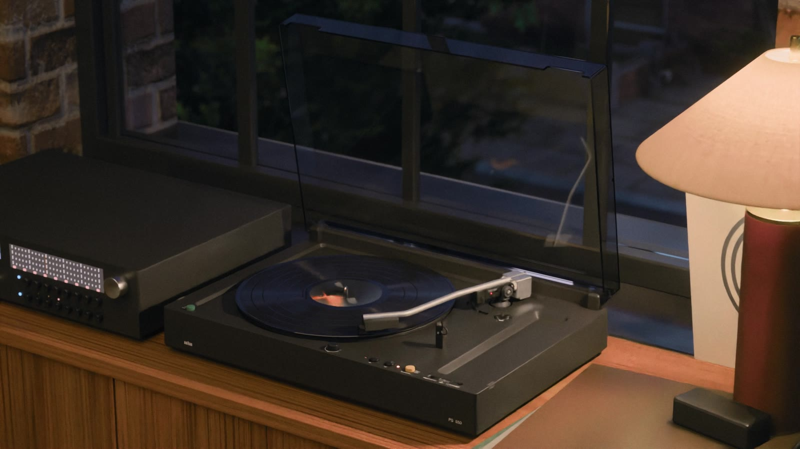
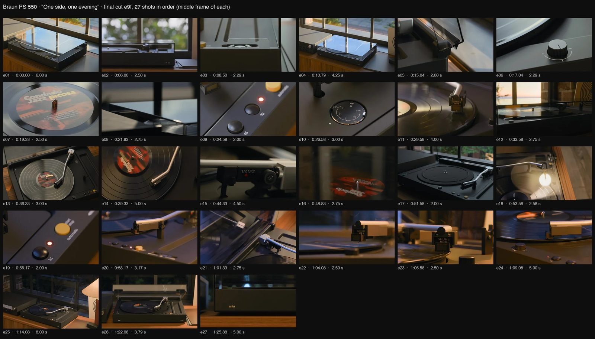
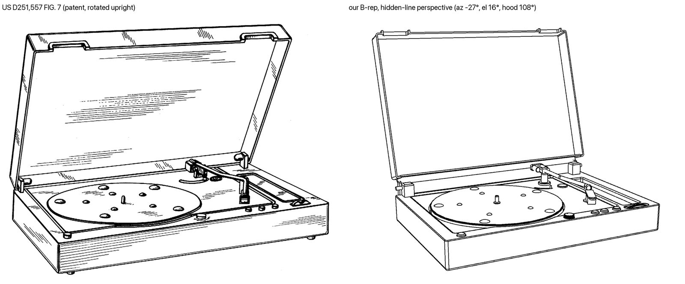
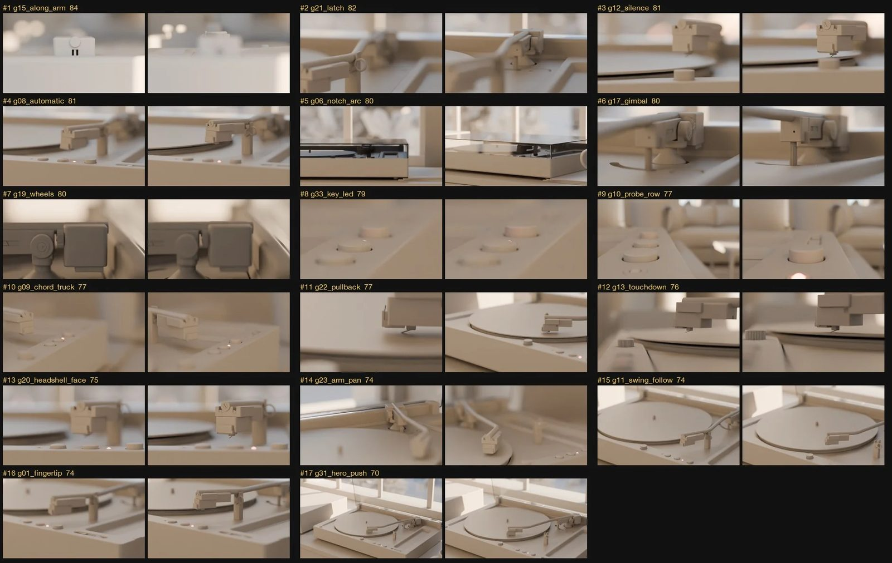

# /3d-product

**I built everything I know about hardware product motion into a free Claude Code skill, so you can tell beautiful product stories from the command line.**



`/3d-product` is a one-shot pipeline for product films. You give Claude Code a prompt and a reference (a design patent, a few photos, a video), and it builds the film the way a product-film crew would: research first, a model measured from the drawings, materials as designed, a set that looks lived in, grey-box compositions, first, key and last frames for every shot, an animatic, an overnight render, sound, and a graded finish. Claude drives Blender, Octane or Cycles, and DaVinci Resolve by script. You direct in plain English and make the calls at each gate.

## The proof

The film above was the test: 98 seconds of a 1976 Braun PS 550 turntable across one evening, modelled from its US design patent (D251,557) and reference photos, rendered in Octane on four GPUs and finished by script. I made it without using Blender, Octane or DaVinci Resolve myself. The skill came out of the nine days it took.





## What it gives you

1. **No 3D software or compositor to operate.** You direct in plain English; the skill runs Blender, Octane and Resolve by script.
2. **A start from a patent or a few photos.** The model is measured from the drawings: the demo sits within a median 0.4 mm of the patent.
3. **Shots locked before you pay for them.** Grey-box compositions, first, key and last frames and playblasts come first. The full render happens once.
4. **Renders you can sleep through.** A small shell script watches the GPUs overnight, restarts anything that hangs and finishes the frames, without spending AI credits on babysitting.
5. **Notes that become rules.** Every note you give can become a standing rule, so the next film starts where the last one ended.
6. **Sets that look lived in.** Rooms are dressed with what would really be there, and checked so no two objects pass through each other.
7. **Film grammar built in.** Simple camera moves, cuts on the product's own motion, light that tells the time of day, a touch of operator drift.
8. **Sound included.** Soundscapes and original music fitted to the cut, mixed and loudness-checked.
9. **It runs on what you have.** A setup probe picks the engine: Cycles on a laptop for previews, Octane on a GPU machine for finals.
10. **Review from anywhere.** Every pass lands as stills, contact sheets and cuts on a FigJam board and in a synced folder you can open on a phone.



## Install

In Claude Code, add this repo as a plugin marketplace and install the plugin:

```
/plugin marketplace add nicceasy/3d-productmotion
/plugin install 3d-product@3d-productmotion
```

Or with the skills CLI:

```
npx skills add nicceasy/3d-productmotion
```

Or copy the skill folder by hand:

```
git clone https://github.com/nicceasy/3d-productmotion.git
cp -R 3d-productmotion/skills/3d-product ~/.claude/skills/
```

Claude picks the skill up on its own when you ask for a product film, a packshot or a render from a patent. You can also call it by name.

## Use

Some ways to start:

- "Use /3d-product to make a 60-second launch film of this speaker from these photos."
- "Model US design patent D251,557 accurately and render a hero packshot."
- "Storyboard a teaser for this lamp: research first, then give me grey-box options."
- "Take this CAD model and put it in a lived-in room at golden hour."

The pipeline stops and waits for you at five points: the film's intention, the compositions and shot list, the cut, the music, and the go for each act of the render. Everything else is gated by checks it runs itself.

## Requirements

- [Claude Code](https://claude.com/claude-code)
- Blender 5.x (built and tested on 5.2)
- Python 3.11 or later with numpy, scipy, Pillow, scikit-image and OpenEXR; build123d for B-rep modelling
- ffmpeg
- DaVinci Resolve Studio for the scripted finish (tested on 21.1)

Optional:
- An NVIDIA GPU machine with Octane (OctaneRender for Blender and OctaneServer, tested on 31.10) for finals. Without it the pipeline renders in Cycles.
- FigJam, through the Figma MCP server, for review boards.
- An AI music generator for the soundtrack. The demo used Stable Audio 3 Medium and Sonilo through Comfy Cloud; check each model's licence before commercial use.

Run `scripts/probe_setup.py` first (stage 0.5). It checks your machines read-only and recommends a render path.

## What's inside

```
skills/3d-product/
  SKILL.md        the pipeline: sixteen gated stages, the rules over every stage, orchestration
  references/     one file per stage or topic: lighting, camera motion, editing, sound, finishing, traps
  scripts/        setup probe, "reads" lighting metric, loudness checker, macro focus calculator,
                  overnight render supervisor template, FigJam section builder
```

## Notes

- Every frame is path-traced from a 3D scene, and no image model touches the rendered frames. The soundtrack is AI-generated.
- The PS 550 is a demonstration subject. Braun is a trademark of its owner, and this project isn't affiliated with Braun. US design patent drawings are public domain.
- The skill keeps its rules as general principles. Keep your own project notes, tools and measurements outside the skill folder.

## Credits

Built by [Nick Conn](https://www.nickconn.com), directing [Claude Code](https://claude.com/claude-code).

## License

[MIT](LICENSE)
